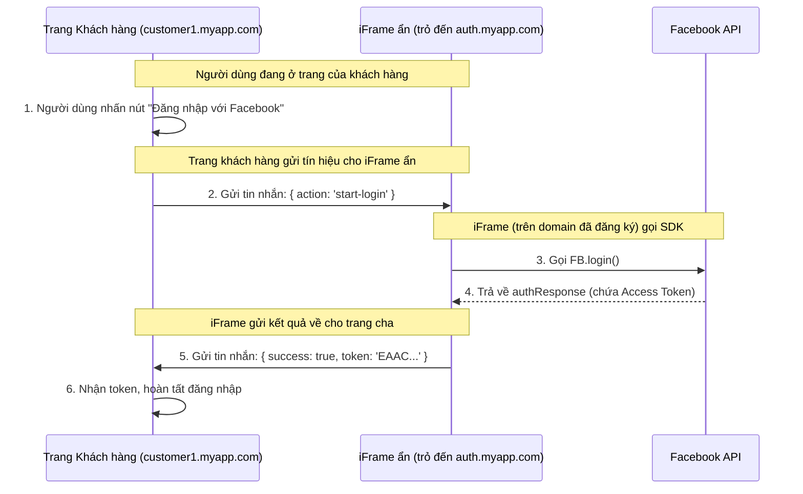

```mermaid
sequenceDiagram
    participant Customer as Trang Khách hàng (customer1.myapp.com)
    participant iFrame as iFrame ẩn (trỏ đến auth.myapp.com)
    participant Facebook as Facebook API

    Note over Customer, iFrame: Người dùng đang ở trang của khách hàng

    Customer->>Customer: 1. Người dùng nhấn nút "Đăng nhập với Facebook"

    Note over Customer, iFrame: Trang khách hàng gửi tín hiệu cho iFrame ẩn
    Customer->>iFrame: 2. Gửi tin nhắn: { action: 'start-login' }

    Note over iFrame, Facebook: iFrame (trên domain đã đăng ký) gọi SDK
    iFrame->>Facebook: 3. Gọi FB.login()
    Facebook-->>iFrame: 4. Trả về authResponse (chứa Access Token)

    Note over iFrame, Customer: iFrame gửi kết quả về cho trang cha
    iFrame->>Customer: 5. Gửi tin nhắn: { success: true, token: 'EAAC...' }

    Customer->>Customer: 6. Nhận token, hoàn tất đăng nhập
```
