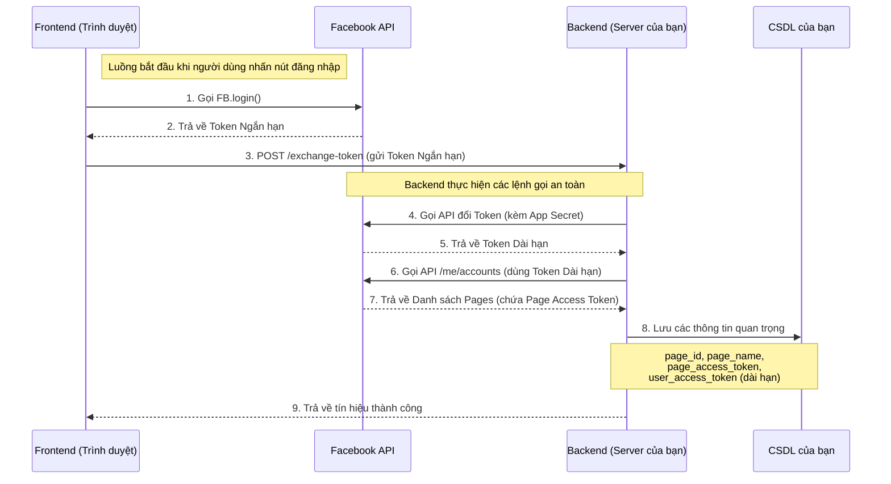

```mermaid
sequenceDiagram
    participant Frontend as Frontend (Trình duyệt)
    participant Facebook as Facebook API
    participant Backend as Backend (Server của bạn)
    participant Database as CSDL của bạn

    Note right of Frontend: Luồng bắt đầu khi người dùng nhấn nút đăng nhập

    %% --- Giai đoạn 1: Lấy Token Ngắn hạn ---
    Frontend->>Facebook: 1. Gọi FB.login()
    Facebook-->>Frontend: 2. Trả về Token Ngắn hạn

    %% --- Giai đoạn 2: Đổi Token qua Backend ---
    Frontend->>Backend: 3. POST /exchange-token (gửi Token Ngắn hạn)
    Note over Backend,Facebook: Backend thực hiện các lệnh gọi an toàn
    Backend->>Facebook: 4. Gọi API đổi Token (kèm App Secret)
    Facebook-->>Backend: 5. Trả về Token Dài hạn

    %% --- Giai đoạn 3: Lấy dữ liệu Trang (Pages) ---
    Backend->>Facebook: 6. Gọi API /me/accounts (dùng Token Dài hạn)
    Facebook-->>Backend: 7. Trả về Danh sách Pages (chứa Page Access Token)

    %% --- Giai đoạn 4: Lưu trữ ---
    Backend->>Database: 8. Lưu các thông tin quan trọng
    Note over Backend,Database: page_id, page_name,<br/>page_access_token,<br/>user_access_token (dài hạn)

    %% --- Giai đoạn 5: Hoàn tất ---
    Backend-->>Frontend: 9. Trả về tín hiệu thành công
```
